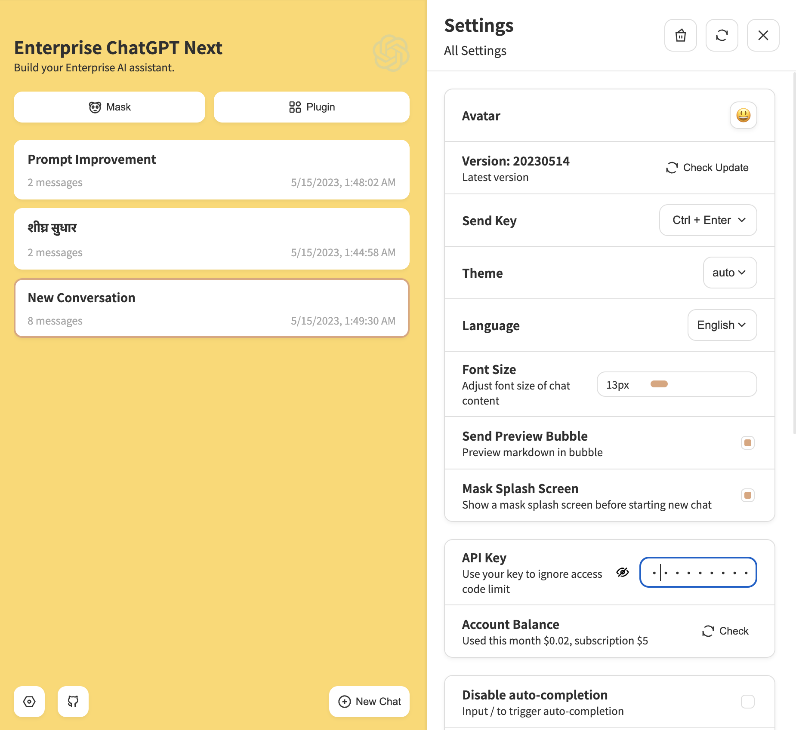
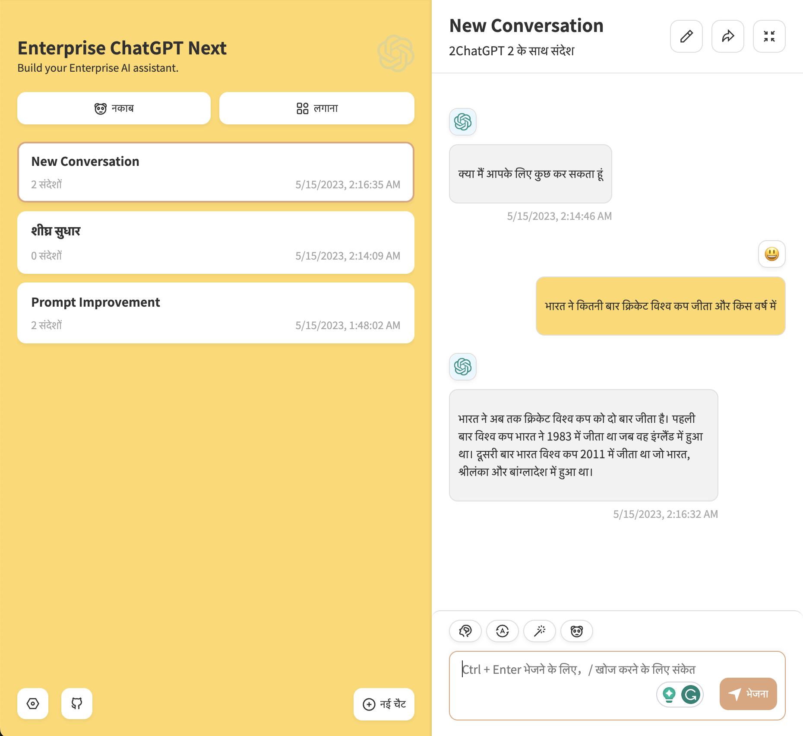

<h1 align="center"> Enterprise ChatGPT with Multilingual support </h1>

[Demo](https://enterprise-gptchat.vercel.app//) / [Issues](https://github.com/SatadruBhattacharjee/openapi-langchain-ai-nextjs-apps/issues) 

## Features

- Privacy first, all data stored locally in the browser
- Markdown support: LaTex, mermaid, code highlight, etc.
- Responsive design, dark mode and PWA
- Fast first screen loading speed (~100kb), support streaming response
- New in v2: create, share and debug your chat tools with prompt templates (mask)
- Awesome prompts powered by [awesome-chatgpt-prompts-zh](https://github.com/PlexPt/awesome-chatgpt-prompts-zh) and [awesome-chatgpt-prompts](https://github.com/f/awesome-chatgpt-prompts)
- Automatically compresses chat history to support long conversations while also saving your tokens
- In Memory Store
- Easy Prompt Template crreations
- I18n: English, हिंदी (Hindi)

## Enterprise SUpport Roadmap

- [ ] Easy Enterprise Theaming support
- [ ] gpt4free support [gpt4free](https://github.com/xtekky/gpt4free)
- [ ] Vestor store intigration
- [ ] Huggingface [Huggingface]https://huggingface.co/ and other LLM support
- [ ] Python based APIs
- [ ] Unit Testing
- [ ] One-Click Installations

## How to use

## Screenshots

![Prompts] (./docs/images/prompts.png)

## Tech Stack

- Next.js 13
- Nx Monorepo pattern
- Typescript
- Component based architecture
- Vercel hosting
